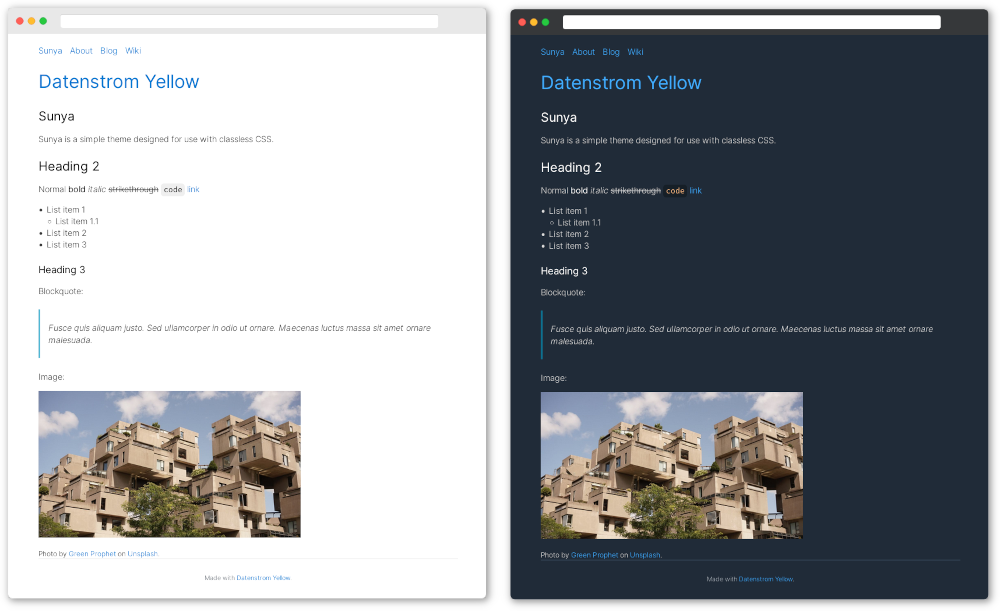

# Sunya 0.8.1

Sunya is a simple theme designed for use with classless CSS.

<!-- <p align="center"></p> -->

## How to install an extension

[Download ZIP file](https://github.com/nevillepark/yellow-sunya/archive/main.zip) and copy it into your `system/extensions` folder. [Learn more about extensions](https://github.com/annaesvensson/yellow-update).

## How to customise a theme

All theme files are stored in your `system/themes` folder. All layout files are stored in your `system/layouts` folder. You can edit these files. Your changes will not be overwritten when the website is updated.

Sunya is designed to be used with [classless CSS themes](https://github.com/dbohdan/classless-css). By default, it uses [Water.css](https://watercss.kognise.dev), but you can replace it with any stylesheet you like. Open `system/themes/sunya.css` and replace the URL in this line:

```
@import url("https://cdn.jsdelivr.net/npm/water.css@2/out/water.css");
```

It also has minimal CSS for some of the [official extensions](https://github.com/datenstrom/yellow-extensions).

The default theme is defined in file `system/extensions/yellow-system.ini`. A different theme can be defined in the [page settings](https://github.com/annaesvensson/yellow-core#settings-page) at the top of each page, for example `Theme: sunya`. [Learn more about themes](https://datenstrom.se/yellow/help/how-to-customise-a-theme).

## Acknowledgements

This extension includes [Kognise's Water.css](https://watercss.kognise.dev) and [Bryan Braun's Anchor.js](https://www.bryanbraun.com/anchorjs/), and is based on [Steffen Schultz's Wittstock](https://github.com/schulle4u/yellow-wittstock). Thank you for the good work.

## Designer

Neville Park. [Get help](https://datenstrom.se/yellow/help/).

## To do

- [ ] Add screenshot
- [ ] Add styling for more extensions
